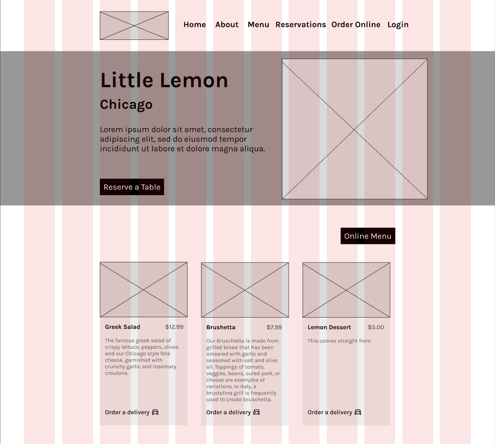
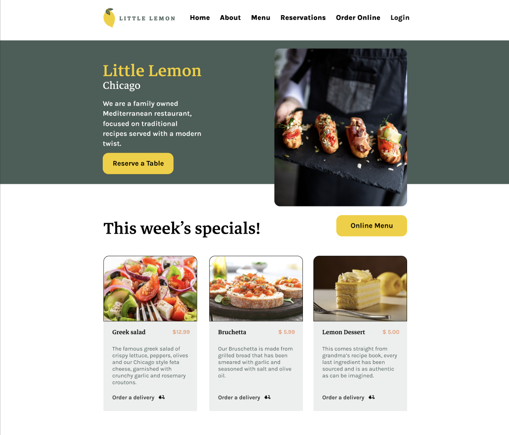

# Little Lemon Restaurant Website Capstone Project

## About

Little Lemon is a responsive restaurant website developed as a capstone project for the Meta Front-End Developer Professional Certificate. The application allows users to reserve a table and view information about the restaurant through an intuitive and accessible interface.

The project demonstrates modern front-end development practices using React, component-based architecture, responsive design principles, form validation, and user experience best practices.

## Technologies Used
- React
- JavaScript (ES6+)
- HTML5
- CSS3
- Mock reservation API
- Git & GitHub

## Installation

1. Clone the repository:

```bash
git clone https://github.com/elanlevin1/little-lemon-app.git
```

2. Navigate to the project directory:

```bash
cd little-lemon-app
```

3. Install dependencies:

```bash
npm install
```

4. Start the development server:

```bash
npm start
```

5. The application will be available at:

http://localhost:3000

## Planning the UX and UI

The project began with creating wireframes for the Little Lemon homepage in Figma. First, I created a low-fidelity wireframe to serve as the blueprint for the homepage.



Next, I developed a high-fidelity wireframe, adding branding, colors, images, typography, and other visual styling.



## Setting up the Project

After completing the wireframes, I set up the project structure using React and created the semantic HTML layout and reusable components for the homepage. I also added meta tags and Open Graph Protocol (OGP) data before implementing the CSS styling based on the high-fidelity design.

Next, I developed the table reservation page using React forms and state management. A mock API was used to retrieve available reservation times. Form validation, unit tests, and accessibility improvements using ARIA attributes were then added.

Once all required functionality was implemented, I evaluated and revised the user experience using Jakob Nielsen's 10 Usability Heuristics for User Interface Design. Key improvements focused on user control and freedom, as well as visibility of system status through clearer visual feedback when interacting with form elements and navigation. Finally, I ensured the site was responsive and functional across desktop and mobile devices.

## Future Improvements
- Add customer information section and the ability to modify or cancel reservations
- Implement the remaining pages linked in the navigation bar
- Add user authentication and login functionality

## Author
Elan Levin

Meta Front-End Developer Professional Certificate Capstone Project